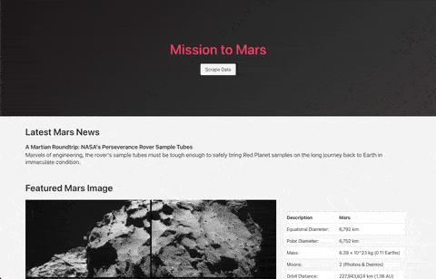

# Web Scraping Challenge

## Overview

This assignment can be divided into 3 parts:

- Scrape various pages for info and images about the Red Planet using BeautifulSoup4, Splinter, and Pandas
- Store the data in a Mongo database
- Build a Flask app with a `/` route that displays the data, and a `/scrape` route that runs the scraping scripts, pulls the data from Mongo, and rebuilds the page

## Sources

### [News](https://mars.nasa.gov/news/)

For this, I used Splinter to visit the page in Chrome and grab the first headline. However, the page grabs articles asynchronously and renders using React, so I needed to use `time.sleep` to prevent the script from grabbing the data until I'd given the page a reasonable amount of time to load.

### [Featured Image](https://www.jpl.nasa.gov/spaceimages/?search=&category=Mars)

This one was fairly simple: Open the page with Splinter, scrape with BS4 to get the image URL, and store that in the database.

### [Facts](https://space-facts.com/mars/)

This one uses Pandas to grab all the tables from the page and load them into DataFrames, then take the first one and use `to_html` to output the table as an HTML string, with a few kwargs to tidy up some of the default classes and add a few Bulma classes.

### [Hemispheres](https://astrogeology.usgs.gov/search/results?q=hemisphere+enhanced&k1=target&v1=Mars)

This was the trickiest, since it involved visiting the page, grabbing the 4 links to the hemisphere pages, the looping through those links to visit each page and grab the image link and title.

## Caching

The `scrape_info` function runs all those scripts and builts a Python dictionary, quits the browser, and returns the dictionary. In `app.py`, the `/scrape` route runs the scraping function, takes the returned dictionary, and updates the entry in the database.

## Rendering

Finally, the `/` route takes the user to the home page that displays the data. First, it grabs the entry from the database containing all the titles and images URLs, then passes that into the `index.html` template. Flask's Jinja2 engine does the rest of the work to insert everything into the HTML to dynamically build the page.

I leaned heavily on [Bulma](https://bulma.io/), a CSS framework similar to Bootstrap, but much more lightweight. In the end I was able to style the page without writing any custom CSS. The table, colors, and cards look pretty nice, and I managed to make it more or less responsive using just a few Bulma classes.